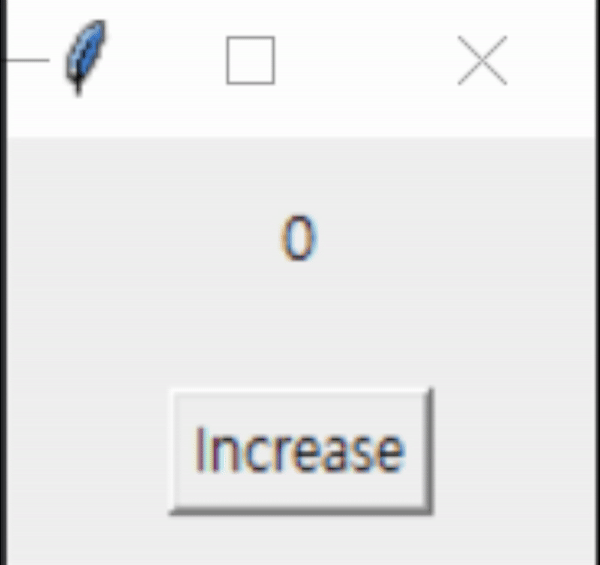

# Tkinter Hover2Click Engine

## Developer
Jehyeon Park

<hr/>

## Demo Image



<hr/>

## Abstract

- Tkinter extension that allow you to click button by just hovering your mouse on the button.

<hr/>

## Requirement

- Tkinter
- Threading

<hr/>

## Versions
| Component | Version |
|-----------|---------|
| Python    |3.9.13|

<hr/>

## Description

- This engine was developed for <a href = 'https://github.com/heat-of-fusion/Eye-Tracking-HCI-Interface'>```Eye-Tracking-HCI-Interface```</a> repository.

<hr/>

## How to Start

1. Clone this repository to your project directory.
2. Inherit ```Hover2ClickButton``` from ```Hover2ClickButton.py``` and override ```click_function```.
3. Use the class just like ```tk.Button```.
4. Demo project is provided in ```demo.py```.

<hr/>

## Policy

- You are free to clone and use this system both personally and commercially.

<hr/>